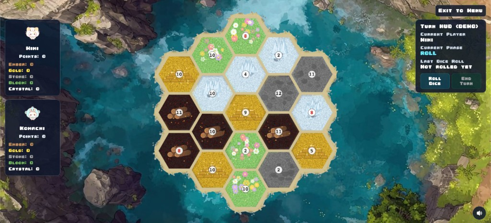

# HexaHaven

HexaHaven is a turn-based strategy hex game built with Phaser, Vite, and Socket.IO.  
Players share a room key, join a lobby, and compete on a hexagonal map where tile outcomes and resources are driven by dice rolls.

Deployed on: https://hexa-haven.vercel.app/
Database deployed on Google Cloud Run

## Game Screen



## Rules

1. **Player count:** games are played with 2-4 players.
2. **Map:** the board is a hexagonal map of resource tiles with number tokens.
3. **Dice and resources:** each turn, dice are rolled and tiles matching the roll generate resources.
4. **Turn actions:** on your turn, collect resources and spend them to:
   - Build roads
   - Place settlements
   - Upgrade settlements
   - Construct special structures
5. **Goals:** each player is assigned 3 goals.
6. **Win condition:** the first player to complete all 3 goals wins.

## How to Build
Run all commands below from the project root folder:

### Prerequisites

- Node.js 18+ (recommended: latest LTS)
- npm

### Install dependencies

```bash
npm install
```

### Build production client

```bash
npm run build
```

## How to Run and Play (Local)

### Start the game

```bash
npm run dev
```

This starts:
- Client (Vite) at `http://localhost:8080`
- Server (Express + Socket.IO) at `http://localhost:3000`

### Play flow

1. Open `http://localhost:8080`.
2. Choose **Host Game** and enter your name to generate a 6-character game key.
3. Other players choose **Join Game**, enter their name and game key.
4. Host starts the game from the waiting room once at least one other player joins.
5. In-game, use the Turn HUD:
   - Click **Roll Dice** during your ROLL phase.
   - Click **End Turn** during your ACTION phase.

## Useful Dev Commands

```bash
npm run dev          # start client + server together
npm run dev:client   # start client only
npm run dev:server   # start server only
npm run build        # build production client bundle
```
